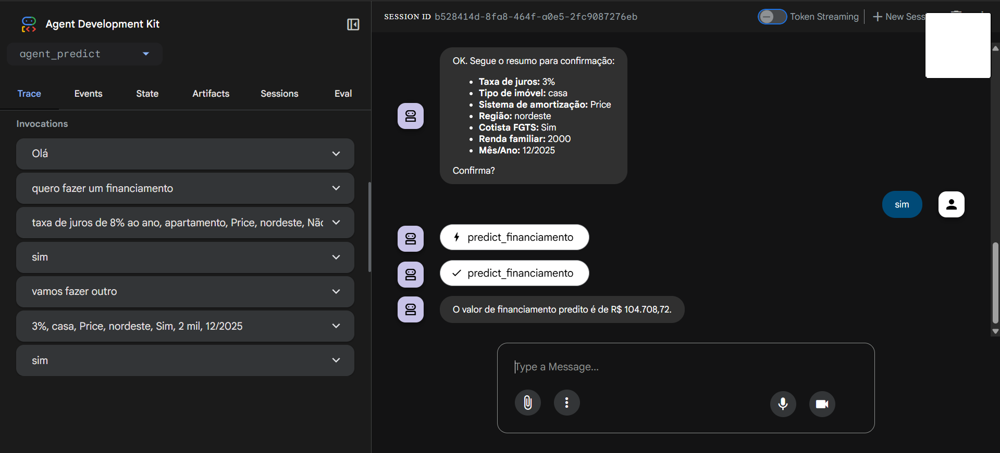

# 📌 ADK Project — Previsão de Financiamentos Habitacionais via FGTS

O **ADK Project** foi desenvolvido como parte de um desafio que utiliza o **Google Agent Development Kit (ADK)** para criar um agente capaz de interagir com **fontes de dados públicas** e aplicar **modelos de Machine Learning clássicos**.

Neste caso, o foco foi o **Programa Minha Casa, Minha Vida** (tema Governo), com ênfase em **prever o valor de um imóvel financiado** para unidades habitacionais financiadas via **FGTS**.


---

## 1️⃣ Definição do Problema

- **Tema**: Governo — Programa Minha Casa, Minha Vida  
- **Foco**: Previsão do valor médio das parcelas financiadas a partir de variáveis como:
  - Tipo de financiamento
  - Região
  - Valor total financiado
  - Taxa de juros
  - Sistema de amortização
  - Renda familiar

### 🎯 Objetivo Principal
Desenvolver um **modelo de regressão** para prever o valor de financiamento habitacional utilizando dados históricos disponibilizados publicamente.

### ❓ Perguntas-Chave
- Quais regiões têm maior eficiência na aplicação dos recursos?
- Como evoluiu a distribuição de unidades ao longo do tempo?
- Existe correlação entre variáveis socioeconômicas e a demanda por financiamento?

---

## 2️⃣ Estrutura de Pastas

```plaintext
besolution-project/
│
├── data/
│   ├── raw_data/                # Dados brutos (.csv originais)
│   └── processed/               # Dados tratados para modelagem
│   └── dictionaries/            # Dicionário de dados
│
├── notebooks/                   # Jupyter Notebooks para análise exploratória e tratamento
│
├── Agent_model/
│   └──agent_predict/
│       └── agent.py              # Código do agente ADK
│       └── .env                  # Arquivo .env para configuração da key
│
├── output/                       # Modelos e colunas salvos (.pkl)
│
├── requirements.txt              # Dependências do projeto
├── dados_fgts_tratados.zip       # Zip dos dados tratados
└── README.md
```

### 3️⃣ Fluxo do Projeto

#### **Etapa 1 — Análise Exploratória e Tratamento**  
**Arquivo**: `notebook/analise_exploratoria.ipynb`

Nessa etapa:

- 📥 **Importa os dados brutos** (`dados_abertos_FGTS_ANALITICO.csv`) - **link** "https://dadosabertos.cidades.gov.br/dataset/dados-do-programa-minha-casa-minha-vida-pmcmv"
- 🔍 **Verifica valores nulos** e inconsistências
- 🧹 **Trata outliers** e valores inválidos
- 📆 **Converte datas** para colunas `ano` e `mes`
- 🏷️ **Codifica variáveis categóricas** usando `LabelEncoder`
- 💾 **Salva o dataset tratado** em `data/processed/dados_fgts_tratados.csv`

#### **Etapa 2 — Modelagem**  
**Arquivo**: `notebook/modelo_financiamento.ipynb`

Etapas realizadas:

- 📂 **Carrega os dados tratados**
- 🏗️ **Define variáveis** features (`X`) e target (`y`)
- ⚙️ **Aplica pré-processamento**:
  - `OneHotEncoder` para colunas categóricas
  - Pass-through para colunas numéricas
- 📈 **Treina um modelo** de **Regressão Linear**
- 📊 **Avalia o desempenho** usando **RMSE** e **R²**
- 💾 **Salva o modelo** (`modelo_financiamento.pkl`) e a **lista de colunas** (`colunas_modelo.pkl`) na pasta `output/`

#### **Etapa 3 — Agente ADK**  
**Arquivo**: `Agent_model/agent_predict/agent.py`

O agente:

- 📂 **Carrega o modelo treinado** (`modelo_financiamento.pkl`)
- 📝 **Recebe as respostas do usuário** e prepara os dados no formato esperado pelo modelo (`preparar_dados_usuario`)
- 🔮 **Realiza a predição** (`predict_financiamento`)
- 🛠️ **Expõe a funcionalidade** como uma `FunctionTool` no **ADK**
- 🤖 **Configura um Agent** com modelo `gemini-2.0-flash`

### 4️⃣ Como Rodar o Projeto

#### **Pré-requisitos**
Instale as dependências do projeto:
```bash
pip install -r requirements.txt
```

#### **(Opcional) Passo 2 — Rodar a análise exploratória e tratamento**
Execute o notebook:
```bash
analise_exploratoria.ipynb
```

### **(Opcional) Passo 3 — Treinar o modelo**
Execute o notebook:
```bash
modelo_financiamento.ipynb
```
Observação: Os dados já processados estão disponíveis na raiz do projeto em um arquivo .zip.

### **Configuração do Agente**
Acesse a pasta:
```bash
Agent_model/model_predict/
```

Edite o arquivo .env e coloque a sua API Key:
```ini
API_KEY=sua_chave_aqui
```

### **Executar o agent**
Entre na pasta:
```bash
cd Agent_model
```

Rode o servidor ADK:
```bash
adk web
```

O agente estará disponível para interações via interface web.